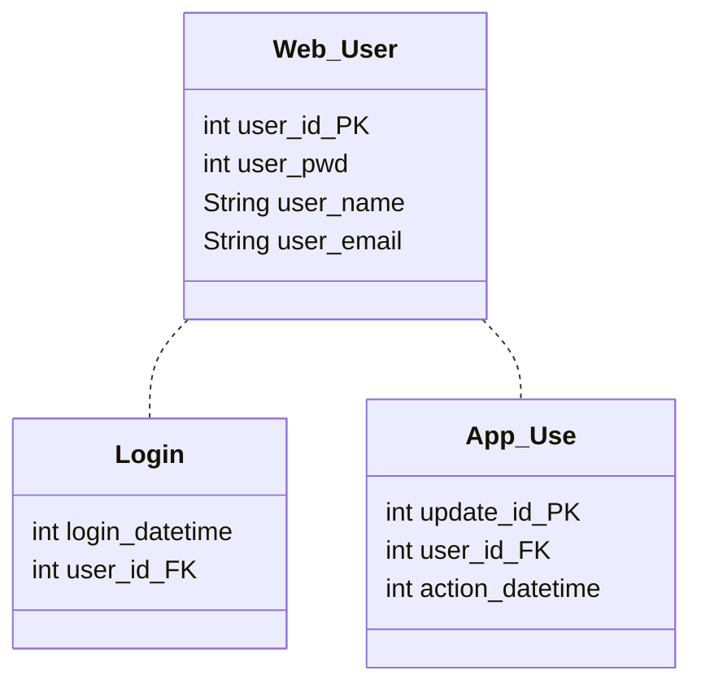
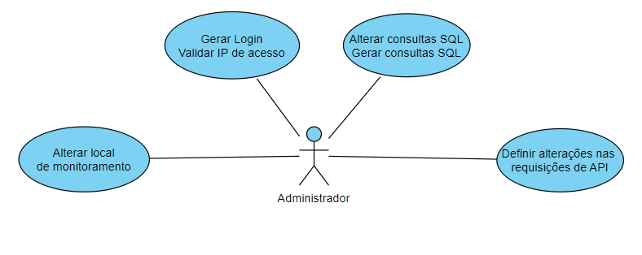
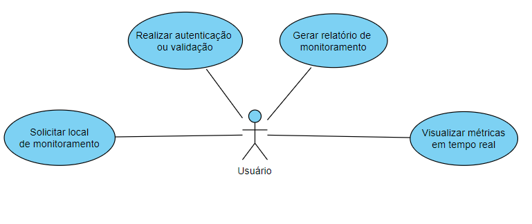
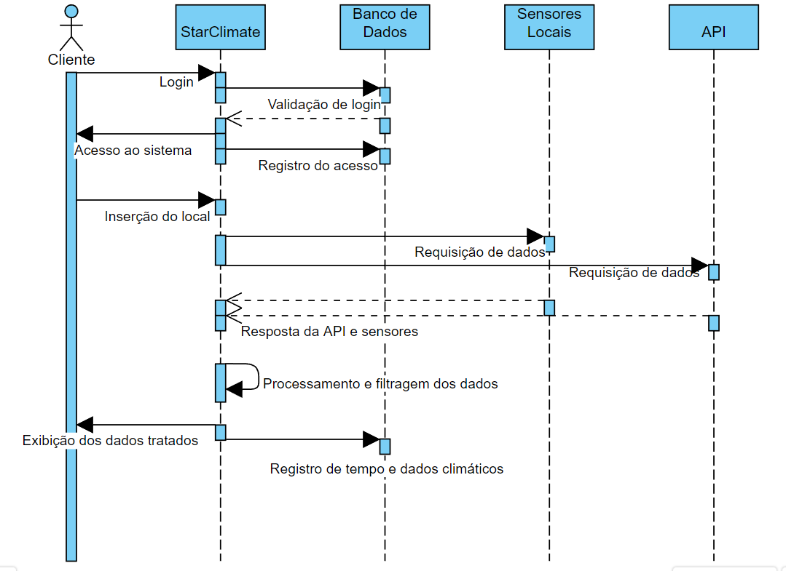
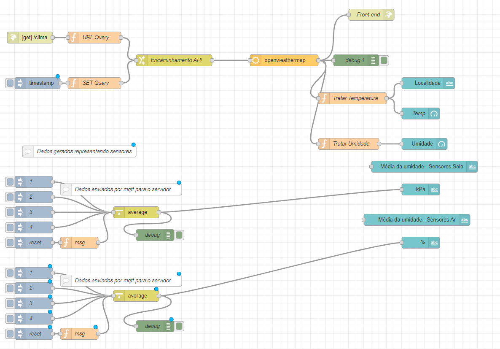
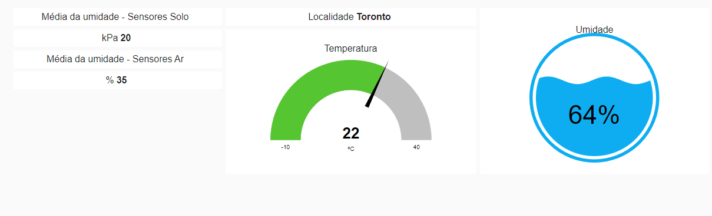

# Projeto StarClimate
Baseado em uma estrutura de node-red, o Starclimate visa buscar dados para otimizar sua plantação

## Embasamento Disciplinar
O projeto visa utilizar o conhecimento adquirido em disciplinas como Programação Web II, Novas Tecnologias (IoT) e Bancos de Dados

## Modelagem de banco de dados

## Diagramas de Casos de Uso

## Diagrama de Sequência

## Formatação do sistema

## Tela inicial (MVP)

