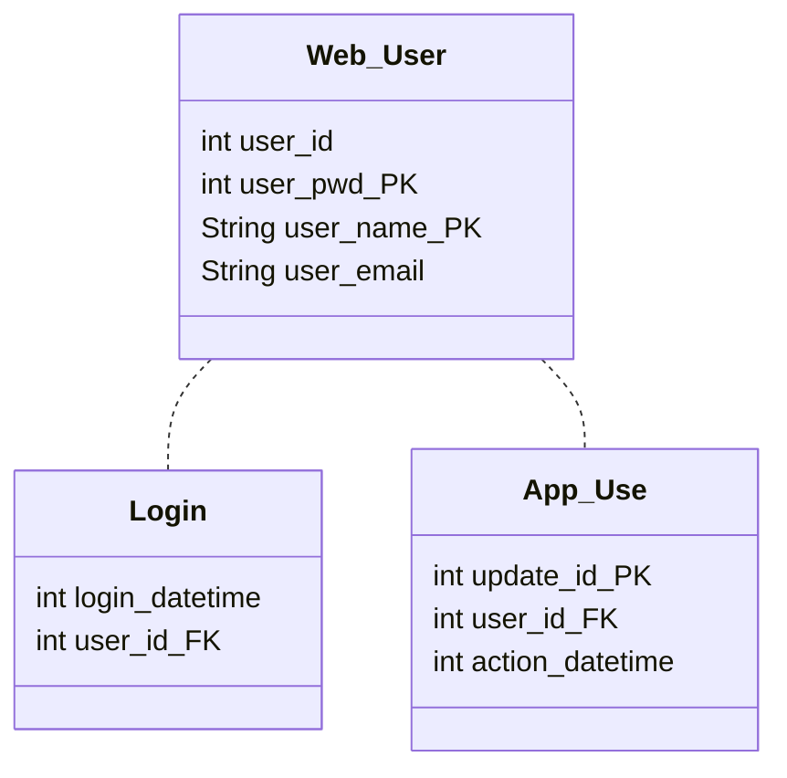
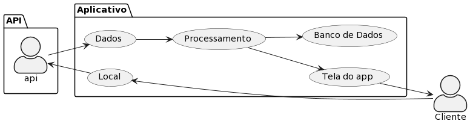

# Projeto StarClimate
Baseado em uma estrutura de node-red, o Starclimate visa buscar dados para otimizar sua plantação

## Modelagem de banco de dados


```mermaid
classDiagram
      Web_User .. Login
      Web_User.. App_Use
      Web_User: int user_id
      Web_User: int user_pwd_PK
      Web_User: String user_name_PK
      Web_User: String user_email
      class Login{
          int login_datetime
          int user_id_FK
      }
      class App_Use{
          int update_id_PK
          int user_id_FK
          int action_datetime
      }
```
## Diagrama de Casos de Uso

```

```


